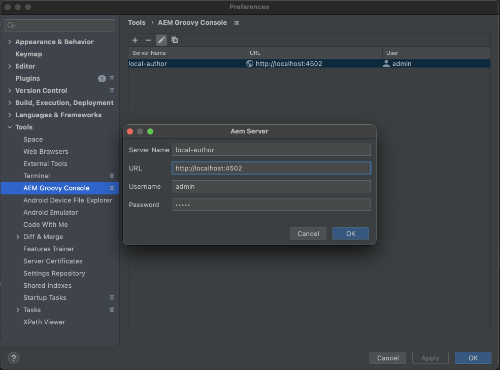
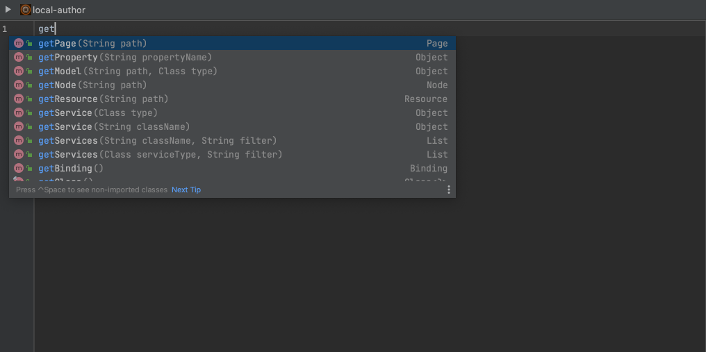

# AEM Groovy Console IntelliJ Plugin (Beta release available)
Adds functionality for executing groovy scripts on running AEM server from Intellij IDEA.

Powered by [AEM Groovy Console](https://github.com/OlsonDigital/aem-groovy-console).

## Features

- Execute groovy scripts on running AEM server from editor
- Script can be executed on multiple servers
- Console output provides a link to the script's source code in case of exception

## How to use
Plugin is available in Jetbrains plugin repository - [AEM Groovy Console](https://plugins.jetbrains.com/plugin/10893-aem-groovy-console)

AEM Servers should be configured in Settings tab

Plugin applied to any *.groovy* file, file path should contain *groovyconsole* substring

